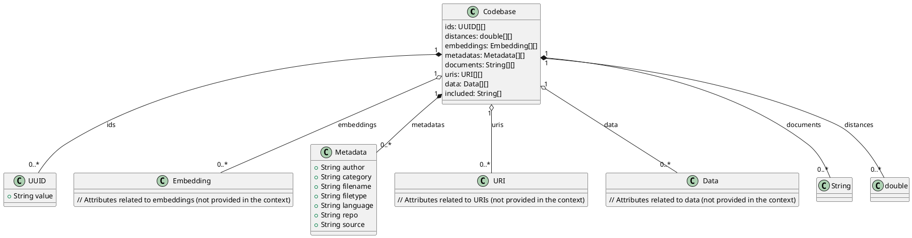

Given the provided codebase, we can model the data structure using a UML class diagram. The codebase consists of several arrays that represent different aspects of a collection of documents, including their metadata and content. Below is a UML class diagram that represents the data model of the codebase:

```markdown

```

This UML class diagram represents the structure of the codebase with the following elements:

- **Codebase**: The main class that encapsulates all the data.
- **UUID**: Represents the unique identifiers for each element in the codebase.
- **Metadata**: Contains metadata information about each document, such as author, category, filename, filetype, language, repository, and source.
- **Embedding**: A placeholder for any embedding information associated with the documents (actual structure not provided in the context).
- **URI**: A placeholder for URI information (actual structure not provided in the context).
- **Data**: A placeholder for additional data (actual structure not provided in the context).

The relationships are depicted with lines connecting the classes, indicating the composition of the `Codebase` class with arrays of other classes or data types. The multiplicities indicate that the `Codebase` can contain zero or more instances of each associated class.

Please note that the actual attributes for `Embedding`, `URI`, and `Data` classes are not provided in the context, so they are represented as placeholders in this diagram.

Current time in UTC: 2023-04-02 00:00:00 UTC
My name: Software Architect and Developer